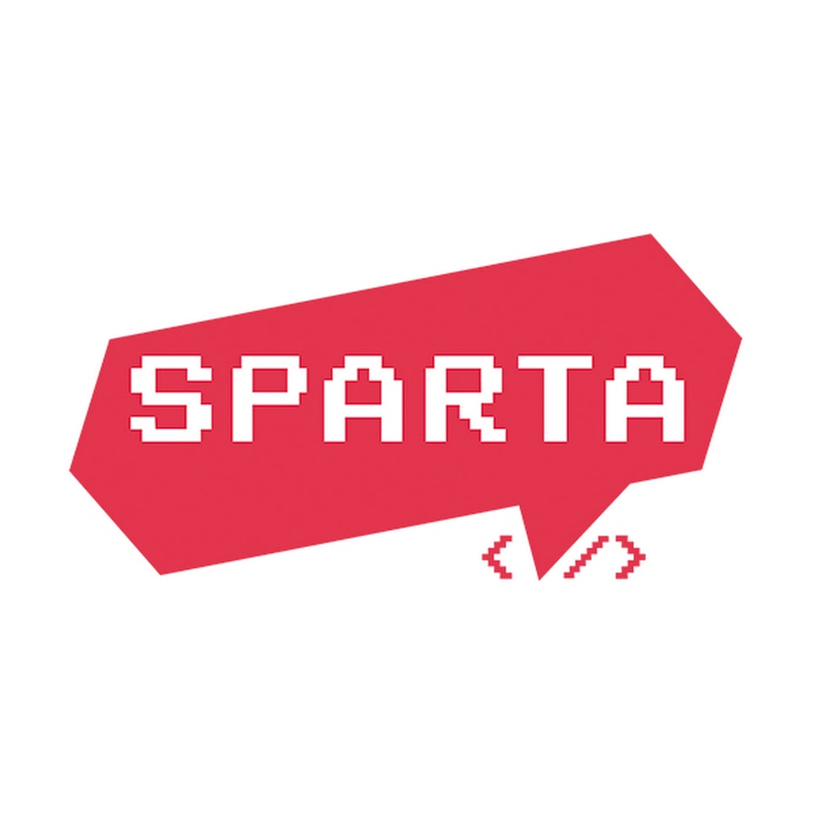
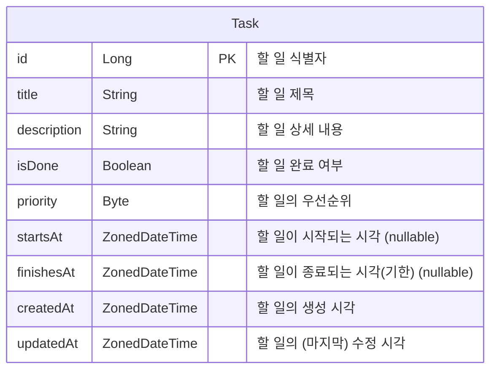

<p align = "center">
    
    
</p

# Todo*A2*
스파르타코딩클럽 내일배움캠프 `Kotlin + Spring` 2기 "주특기+" 주차 과제

"할 일"에 대하여 캠프에서 다뤘던 과제의 3번째 버전

- [Todo](https://github.com/Turbstructor/SCCNBCKS2-Todo): "Spring 기초" 주차 과제
- [TodoA1](https://github.com/Turbstructor/SCCNBCKS2-TodoA1): "Spring 심화" 주차 과제

# 개발 환경

| 기준  | 내용                                                                                                   |
|-----|------------------------------------------------------------------------------------------------------|
| OS  | `Windows 11 Home 23H2` + `Arch Linux w/ Linux-zen 6.9.x`                                             |
| IDE | `IntelliJ IDEA 2024.1.4`                                                                             |
| SDK | 개발 언어: `Kotlin 1.9.24`(JVM: `OpenJDK 17.0.11`)<br/>프레임워크: `Spring Boot 3.3.1`<br/>빌드 툴: `Gradle 8.8` |
| DB  | `MariaDB 11.4.2`                                                                                     |

---

# 목차

<!-- TOC -->
* [Todo*A2*](#todoa2)
* [개발 환경](#개발-환경)
* [목차](#목차)
* [1. 과제 요구사항 및 이행사항](#1-과제-요구사항-및-이행사항)
* [2. 프로젝트 내용](#2-프로젝트-내용)
  * [2-1. ERD](#2-1-erd)
  * [2-2. API Call](#2-2-api-call)
  * [2-3. Data-Transfer Objects (DTOs)](#2-3-data-transfer-objects-dtos)
* [3. 과제 이행 상세 내역](#3-과제-이행-상세-내역)
  * [Step 1. `Controller`, `Service` 패키지 내 클래스 개선 (관련 Commit)](#step-1-controller-service-패키지-내-클래스-개선-관련-commit)
  * [Step 2. JPA 심화 기술을 사용하여 검색 기능 개선 (관련 Commit)](#step-2-jpa-심화-기술을-사용하여-검색-기능-개선-관련-commit)
  * [Step 3. 테스트 코드 작성](#step-3-테스트-코드-작성)
<!-- TOC -->

---

# 1. 과제 요구사항 및 이행사항

<details> <summary>Step 1. `Controller`, `Service` 패키지 내 클래스 개선 (<a href="https://github.com/Turbstructor/SCCNBCKS2-TodoA2/commit/2ab5aad37a751b5bd4c449d2c7a33a75851dcf21">관련 Commit</a>)</summary>

- [x] Step 1-1. `Controller` 개선: `@RestControllerAdvice`를 사용하여 예외 처리 공통화 ([관련 Commit](https://github.com/Turbstructor/SCCNBCKS2-TodoA2/commit/c3a1dec6d9b68f72438c07c246f88abca7bc3cff))
- [x] Step 1-2. `Service` 개선: `Service`(**인터페이스**)와 `ServiceImpl`(**구현체**)로 분리 ([관련 Commit](https://github.com/Turbstructor/SCCNBCKS2-TodoA2/commit/09328fd5c500c11050b0885271a379758d7b2a6d))
- [x] Step 1-3. 사용자 예외 정의 ([관련 Commit](https://github.com/Turbstructor/SCCNBCKS2-TodoA2/commit/517eea8e8f2bcceef5c5b263ad85537ceb829aea))
- [x] Step 1-4. `Spring AOP` 적용 ([관련 Commit](https://github.com/Turbstructor/SCCNBCKS2-TodoA2/commit/614afbf2e91454d35eb50f75b473290a3d3707aa))
</details>

<details> <summary>Step 2. JPA 심화 기술을 사용하여 검색 기능 개선 (<a href="https://github.com/Turbstructor/SCCNBCKS2-TodoA2/commit/c9ac86fb58d487f7986fc3abbbf3aa2d17b04188">관련 Commit</a>)</summary>

- [x] Step 2-1. `QueryDSL`을 사용하여 검색 기능 구현 ([관련 Commit](https://github.com/Turbstructor/SCCNBCKS2-TodoA2/commit/44c1a93ca71cc1612f1019f1a6c3debd172c1d8c))
- [x] Step 2-2. `Pageable`을 사용하여 Paging/Sorting 구현 ([관련 Commit](https://github.com/Turbstructor/SCCNBCKS2-TodoA2/commit/19f6cb1b0a69b5cfa0c6849c02c2052ec1d7c04c))
- [x] Step 2-3. 다양한 조건에 대한 동적 쿼리 기능 구현 ([관련 Commit](https://github.com/Turbstructor/SCCNBCKS2-TodoA2/commit/371cf6e28553a75d4ee19f46b12fb408f95e91e2))

</details>

<details> <summary>Step 3. 테스트 코드 작성</summary>

- [ ] Step 3-1. `Controller` 테스트 코드 작성
- [ ] Step 3-2. `Service` 테스트 코드 작성
- [x] Step 3-3. `Repository` 테스트 코드 작성 ([관련 Commit #1](https://github.com/Turbstructor/SCCNBCKS2-TodoA2/commit/bb4067c4df70ab45089c4f837ba91296dd60bed5), [관련 Commit #2](https://github.com/Turbstructor/SCCNBCKS2-TodoA2/commit/021d5840e8df9e0f138669382653374d484e16e6))
</details>

<details> <summary>Step 4. `AWS`를 활용한 기능 추가/배포</summary>

- [ ] Step 4-1. `AWS S3`를 이용한 이미지 업로드 기능 구현
- [ ] Step 4-2. `AWS EC2`를 이용한 `.jar` 앱 파일 배포

</details>

---

# 2. 프로젝트 내용

## 2-1. ERD


## 2-2. API Call

- 아래 `URI`는 기본 URI를 `/api/v1/tasks` 뒤에 오는 추가적인 URI를 가리킴

| HTTP Method | URI                    | Request                                                            | Response Status Code | Response              |
|-------------|------------------------|--------------------------------------------------------------------|----------------------|-----------------------|
| `POST`      | -                      | `@RequestBody`: `CreateTaskRequest`                                | `201`                | `TaskResponse`        |
| `GET`       | -                      | `@PageDefault`: `Pageable`<br/>`@RequestParam`: `ReadTaskRequest`  | `200`                | `Slice<TaskResponse>` |
| `GET`       | `/{taskId}`            | `@PathVariable`: `taskId`                                          | `200`/`404`          | `TaskResponse`        |
| `PUT`       | `/{taskId}`            | `@PathVariable`: `taskId`<br/>`@ResponseBody`: `UpdateTaskRequest` | `200`/`404`          | `TaskResponse`        |
| `PATCH`     | `/{taskId}/completion` | `@PathVariable`: `taskId`                                          | `200`/`404`          | `TaskResponse`        |
| `DELETE`    | `/{taskId}`            | `@PathVariable`: `taskId`                                          | `204`                | -                     |

## 2-3. Data-Transfer Objects (DTOs)

- `CreateTaskRequest` : 할 일(`Task`) 생성 시 서버에 제공하는 데에 사용하는 Request DTO
```kotlin
data class CreateTaskRequest (

    val title: String,                      // 할 일 제목
    val description: String,                // 할 일 내용
    val isDone: Boolean = false,            // 할 일 완료 여부 (기본값: false)
    val priority: Byte = 0,                 // 할 일 우선순위(높을수록 더 우선적인 것을 의미) (기본값: 0)
    val startsAt: ZonedDateTime? = null,    // 할 일의 시작 시각 (기본값: null)
    val finishesAt: ZonedDateTime? = null   // 할 일의 종료 시각(기한) (기본값: null)
)
```
- `UpdateTaskRequest`: 할 일(`Task`) 수정 시 서버에 제공하는 정보의 Request DTO
```kotlin
data class UpdateTaskRequest (

    val title: String,              // 수정할 할 일의 제목
    val description: String,        // 수정할 할 일의 내용
    val isDone: Boolean,            // 수정할 할 일의 완료 여부
    val priority: Byte,             // 수정할 할 일의 우선순위
    val startsAt: ZonedDateTime?,   // 수정할 할 일의 시작 시각
    val finishesAt: ZonedDateTime?  // 수정할 할 일의 종료 시각
)
```
- `ReadTaskRequest`: 할 일(`Task`) 검색 시 서버에 제공하는 쿼리들의 Request DTO
```kotlin
@JsonNaming(PropertyNamingStrategies.KebabCaseStrategy::class)
@JsonIgnoreProperties(ignoreUnknown = true)
data class ReadTaskRequest(

    val titleContains: String? = null,          // 찾을 task의 제목에 포함된 단어
    val descriptionContains: String? = null,    // 찾을 task의 내용에 포함된 단어
    val isDone: String? = null,                 // 찾을 task의 완료 여부 기준
    val minPriority: String? = null,            // 찾을 task의 최소 요구 우선순위
    val maxPriority: String? = null,            // 찾을 task의 최대 요구 우선순위
    val notStarted: String? = null,             // 찾을 task의 시작 여부(`startsAt`이 값을 가진 task만 검색)
    val notFinished: String? = null             // 찾을 task의 종료 여부(`finishesAt`이 값을 가진 task만 검색)
)

```

---

# 3. 과제 이행 상세 내역

구현한 기능에 대해 설명이 필요한 부분만 내용을 적어뒀습니다.

## Step 1. `Controller`, `Service` 패키지 내 클래스 개선 ([관련 Commit](https://github.com/Turbstructor/SCCNBCKS2-TodoA2/commit/2ab5aad37a751b5bd4c449d2c7a33a75851dcf21))

- [x] Step 1-1. `Controller` 개선: `@RestControllerAdvice`를 사용하여 예외 처리 공통화 ([관련 Commit](https://github.com/Turbstructor/SCCNBCKS2-TodoA2/commit/c3a1dec6d9b68f72438c07c246f88abca7bc3cff))
- [x] Step 1-2. `Service` 개선: `Service`(**인터페이스**)와 `ServiceImpl`(**구현체**)로 분리 ([관련 Commit](https://github.com/Turbstructor/SCCNBCKS2-TodoA2/commit/09328fd5c500c11050b0885271a379758d7b2a6d))
- [x] Step 1-3. 사용자 예외 정의 ([관련 Commit](https://github.com/Turbstructor/SCCNBCKS2-TodoA2/commit/517eea8e8f2bcceef5c5b263ad85537ceb829aea))
```kotlin
package spartacodingclub.nbcamp.kotlinspring.assignment.sccnbcks2todoa2.global.exception.type

import java.io.Serial

class NonExistentEntityException : RuntimeException {

    @Serial
    private val serialVersionUID: Long = -1072869312753892L


    constructor() : super()
    constructor(message: String) : super(message)
    constructor(cause: Throwable): super(cause)
    constructor(message: String, cause: Throwable) : super(message, cause)
    constructor(message: String, cause: Throwable, enableSuppression: Boolean, writableStackTrace: Boolean)
    : super(message, cause, enableSuppression, writableStackTrace)

}
```
`Task`와 관련하여, 찾고자 하는 `Task`가 존재하지 않을 경우 발생시켰던 `RuntimeException`을 기반으로 하여 `NonExistentEntityException`을 생성(`EntityNotFoundException`과 비슷한 의미로 사용)

- [x] Step 1-4. `Spring AOP` 적용 ([관련 Commit](https://github.com/Turbstructor/SCCNBCKS2-TodoA2/commit/614afbf2e91454d35eb50f75b473290a3d3707aa))
```kotlin
@Aspect
@Component
class ApiCallLoggerAop {

    private val logger = KotlinLogging.logger {}

    @Pointcut("execution(* spartacodingclub.nbcamp.kotlinspring.assignment.sccnbcks2todoa2.domain.*.controller.*.*(..))")
    fun cut() {}

    @Before("cut()")
    fun before(
        joinPoint: JoinPoint
    ) {

        (joinPoint.signature as MethodSignature).method.name.let { methodName ->
            logger.info { "Controller method \"$methodName\" starting execution" }
        }
    }

    @AfterReturning(
        value = "cut()",
        returning = "obj"
    )
    fun afterReturning(
        joinPoint: JoinPoint,
        obj: Any
    ) {

        (joinPoint.signature as MethodSignature).method.name.let { methodName ->
            logger.info { "Controller method \"$methodName\" returning value: " +
                    "$obj"
            }
        }
    }

    @AfterThrowing(
        value = "cut()",
        throwing = "ex"
    )
    fun afterThrowing(
        joinPoint: JoinPoint,
        ex: Exception
    ) {

        (joinPoint.signature as MethodSignature).method.name.let { methodName ->
            logger.info { "Controller method \"$methodName\" throwing exception: " +
                    "${ex.javaClass.canonicalName}: " +
                    "${ex.message}"
            }
        }
    }
}
```
어떤 API Call을 만들 때 마다 DB 접근이 생길 때 그 쿼리가 출력되곤 했는데, 이 쿼리가 어느 API Call에서 불려지는지 확인하고자 **`Controller`의 함수들을 진행할 때 실행 전후(예외 발생 상황 포함)로 특정 함수들의 실행 기록을 출력**하는 기능을 추가함

이 기능을 구현하기 위해 [kotlin-logging](https://github.com/oshai/kotlin-logging)을 사용함

## Step 2. JPA 심화 기술을 사용하여 검색 기능 개선 ([관련 Commit](https://github.com/Turbstructor/SCCNBCKS2-TodoA2/commit/c9ac86fb58d487f7986fc3abbbf3aa2d17b04188))

- [x] Step 2-1. `QueryDSL`을 사용하여 검색 기능 구현 ([관련 Commit](https://github.com/Turbstructor/SCCNBCKS2-TodoA2/commit/44c1a93ca71cc1612f1019f1a6c3debd172c1d8c))
- [x] Step 2-2. `Pageable`을 사용하여 Paging/Sorting 구현 ([관련 Commit](https://github.com/Turbstructor/SCCNBCKS2-TodoA2/commit/19f6cb1b0a69b5cfa0c6849c02c2052ec1d7c04c))
- [x] Step 2-3. 다양한 조건에 대한 동적 쿼리 기능 구현 ([관련 Commit](https://github.com/Turbstructor/SCCNBCKS2-TodoA2/commit/371cf6e28553a75d4ee19f46b12fb408f95e91e2))
```kotlin
    private fun allConditions(
        queries: ReadTaskRequest
    ) = BooleanBuilder()
        .and( titleContaining(queries.titleContains) )
        .and( descriptionContaining(queries.descriptionContains) )
        .and( isDone(queries.isDone?.toBoolean()) )
        .and( priorityAtMinimum(queries.minPriority?.toByte()) )
        .and( priorityAtMaximum(queries.maxPriority?.toByte()) )
        .and( queries.notStarted?.toBoolean()?.let { notStartedFlag ->
            ZonedDateTime.now(ZoneOffset.UTC).let { current ->
                if (notStartedFlag) startsAtAfter(current)
                else startsAtBefore(current)
            }
        })
        .and( queries.notFinished?.toBoolean()?.let { notFinishedFlag ->
            ZonedDateTime.now(ZoneOffset.UTC).let { current ->
                if (notFinishedFlag) finishesAtAfter(current)
                else finishesAtBefore(current)
            }
        })
```

동적 쿼리 기능에 들어간 검색 조건들:
- 제목 (중 키워드 **포함**) (`titleContaining`)
- 설명 (중 키워드 **포함**) (`descriptionContaining`)
- 완료/미완료 (**일치**) (`isDone`)
- 우선순위 (의 **최소값** / **최대값**) (`priorityAtMinimum` / `priorityAtMaximum`)
- 시작 여부 (`startsAfAfter` / `startsAtBefore`)
  - 해당 할 일(`Task`)의 시작 시간(`startsAt`)이 `null`이 아니여야 함
  - `notStarted`가 `true`일 경우 시작 전 일들을 확인(`startsAtAfter(current)`)
  - `notStarted`가 `false`일 경우 시작된 일들을 확인(`startsAtBefore(current)`)
- 종료 여부 (`finishesAtAfter` / `finishesAtBefore`)
  - 해당 할 일(`Task`)의 종료 시간(`finishesAt`)이 `null`이 아니어야 함
  - `notFinished`가 `true`일 경우 종료 전 일들을 확인(`finishesAtBefore(current)`)
  - `notFinished`가 `false`일 경우 종료된 일들을 확인(`finishesAtAfter(current)`)

## Step 3. 테스트 코드 작성

- [ ] Step 3-1. `Controller` 테스트 코드 작성
- [ ] Step 3-2. `Service` 테스트 코드 작성
- [x] Step 3-3. `Repository` 테스트 코드 작성 ([관련 Commit #1](https://github.com/Turbstructor/SCCNBCKS2-TodoA2/commit/bb4067c4df70ab45089c4f837ba91296dd60bed5), [관련 Commit #2](https://github.com/Turbstructor/SCCNBCKS2-TodoA2/commit/021d5840e8df9e0f138669382653374d484e16e6))